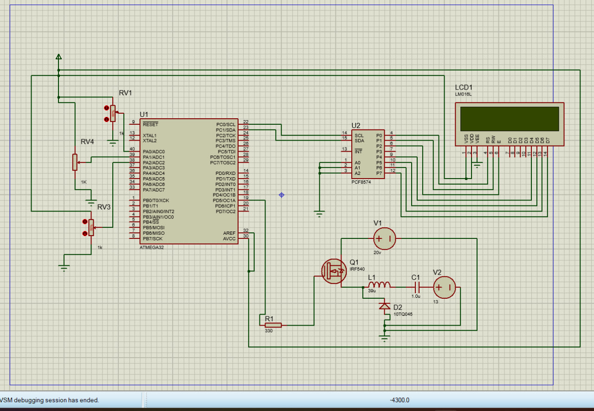

# Project 11: Solar Charge Controller & Energy Monitor
A professional embedded systems project designed to implement a robust, multi-layered Solar Charge Controller and Energy Management System utilizing an ATmega32 microcontroller.
---
## 👥 Prepared By
* Maryam Ahmed Mohammed
* Tasneem Mohammed Nashat
* Hajar Jumaa Ali
---
## 🏗️ System Architecture & Modules Overview
This document outlines the software architecture, module layering, and timing execution strategy for PRJ-11-SOLAR.
### 1. Layer: MCAL (Microcontroller Abstraction Layer)
*Direct interface with ATmega32A hardware peripherals and interrupt management.*

| Module | Purpose | Key Features / Registers |
| :--- | :--- | :--- |
| DIO | Digital Pin Operations | PORT, DDR, PIN |
| ADC | Analog sensor sampling (6 channels) | ADMUX, ADCSRA, Prescaler 64 |
| TIMER0 | System Tick generation (10 ms) | CTC Mode, OCR0=77, Prescaler 1024 |
| TIMER1 | Fast PWM for Buck Converter (40 kHz) | Fast PWM Mode 14, ICR1=199 |
| TIMER2 | Error tone & audio notifications | Fast PWM, OC2 |
| EXTI | Ultra-fast protection interrupt | INT0 (Falling Edge), Latency < 1 ms |
| USART | Serial Telemetry & Console interface | 9600 8N1, Circular Rx Buffer |
| SPI | External EEPROM communication | Master Mode, f/16 |
| I2C | LCD display control via PCF8574 | Master Mode, 100 kHz |
| GI | Global Interrupt Control | SREG (GIE Bit) |

---
### 2. Layer: HAL (Hardware Abstraction Layer)
*Hardware encapsulation and system driver abstraction.*

| Module | Purpose | Dependencies |
| :--- | :--- | :--- |
| ANALOG | Scaling, filtering, and physical conversion | MCAL_ADC |
| CONVERTER | Duty cycle clamping & PWM writer for OCR1A | MCAL_TIMER1 |
| LCD_I2C | Flicker-free UI page rendering | MCAL_I2C |
| EEPROM_SPI | Configuration, lifetime energy & 30-day log | MCAL_SPI |
| DISCONNECT | PV array & load disconnection control | MCAL_DIO |
| BARGRAPH_LED | SoC indication & LED pattern rendering | MCAL_DIO |
| BUTTONS | User input debouncing & duration logic | MCAL_DIO |
| FAN_THERMAL | Cooling fan & thermal derating control | MCAL_DIO |
| BUZZER | Audio alert generation on trip events | MCAL_TIMER2 |

---
### 3. Layer: APP (Application Logic)
*Core algorithmic decision-making and state control.*

| Module | Purpose | Key Logic |
| :--- | :--- | :--- |
| CHG_FSM | Multi-stage charging state machine | Bulk, Absorb, Float, Equalize |
| CTRL_LOOP | Core control loop execution | MPPT P&O / PI Voltage Regulator |
| SOC_ENERGY | Coulomb counting & energy accumulators | Safe 32-bit arithmetic |
| PROTECT | System safety & fault detection | Priority Trip Ladder |
| DAYLOG | 30-day historical data management | EEPROM Ring Buffer |
| SCHEDULER | Task orchestration (T-5 to T-11) | Time-Triggered Architecture ($\pm 2$ ms) |
| CONSOLE | UART command parsing & telemetry frames | String Processing / CLI |

---
### 4. Layer: LIB & Shared Utilities
*Generic tools and shared data structures.*

| Component | Content |
| :--- | :--- |
| **STD_TYPES.h** | Standard integer definitions (uint8_t, uint32_t, etc.) |
| **BIT_MATH.h** | Bit manipulation macros (SET_BIT, GET_BIT, CLR_BIT) |
| **SOLAR_TYPES.h** | Centralized structs (SolarData_t, SolarCfg_t, DayLog_t) |
| **RING_BUFFER.h** | Circular buffer for non-blocking UART handling |

---
## ⏱️ 5. Execution Schedule (10 ms Base Tick)

| Task ID | Task Name | Period | Purpose |
| :--- | :--- | T-11--- |
| **T-11** | Task_EEPROM | 10 ms | Buttons debounce & EEPROM T-10ite |
| **T-10** | Task_Console | 20 ms | UART command lT-5sing |
| **T-5** | Task_Control | 100 ms | MPPT / PI Loop & DutyT-6ment |
| **T-6** | Task_Display | 500 ms | LCD refresh & Bargraph LT-7erns |
| **T-7** | Task_1Hz | 1000 ms | Energy tracking, SoC & LVD/LVRT-9tion |
| **T-9** | Task_Thermal | 2000 ms | Temperature compensation T-8peed |
| **T-8** | Task_Report | 2000 ms | Telemetry frame generation over UART |

---
## 💡 Detailed Component Breakdown & Implementation Notes
### 🔬 1. Detailed View of 00_lib (Libraries)
* **STD_TYPES.h:** Used across all layers to ensure cross-platform data type consistency and fixed-width integers.
* **BIT_MATH.h:** Contains inline macros to manipulate hardware registers directly without function-call overhead.
* **SOLAR_TYPES.h:** Aggregates system metrics, configurations, and historical log structures into clean, typed data models.
* **RING_BUFFER.h:** Implements a memory-safe circular queue for asynchronous, non-blocking UART transmission and reception.
### ⚙️ 2. Detailed View of 01_mcal (Microcontroller Abstraction Layer)
* Directly talks to the ATmega32A hardware pDIO / GI: * **DIO / GI:** Manages pin directions, states, and global interrupt flags (SREG).
  * **ADC:** Configured via ADMUX and ADCSRA with a Prescaler of 64 to sample analog photovoltaic parTimers:ely.
  * **Timers:** 
    * Timer0 triggers the core 10 ms system tick via CTC mode (OCR0 = 77).
    * Timer1 drives the high-frequency 40 kHz Fast PWM (ICR1 = 199) for the DC-DC buck converter.
    * Timer2 handles buzzerCommunication (USART, SPI, I2C):(USART, SPI, I2C):** Provides low-level drivers for debugging, external EEPROM storage, and I2C LCD expansion (PCF8574).
  * **EXTI:** Captures critical fault events instantaneously on falling edges (INT0).
---

## 📷 Hardware & Simulation

